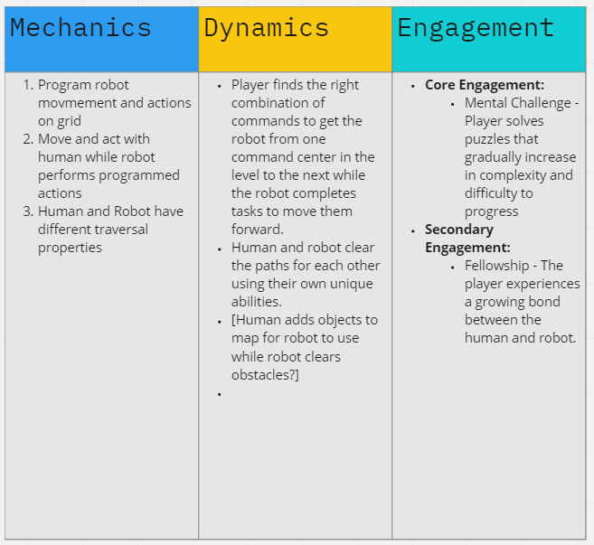

# mochi
GGJ 2021

<h1>Releases</h1>

<h1>Story</h1>

Ritsu and MOCHI is an isometric puzzle game. Follow Ritsu the young robotics engineer and MOCHI, his trusty robot as they explore an abandoned robot factory. Team up to solve puzzles and delve deeper to find Ritsu's great-grandpa's schematics. Interact with the computer consoles to upgrade MOCHI's software and program MOCHI's movements. The key to solving the puzzles starts at the computer consoles. Ritsu can interact with consoles and pull small levers. MOCHI presses pressure plates and special robot levers. Ritsu can't walk through clouds of poison gas, but MOCHI can travel through these without a problem.

<h1>Design</h1>

<h2>Game Loop</h2>

<h2>Mechanics Dynamics Effects</h2>

<h2>Mechanics Brainstorm</h2>

<h2>Controlling the Player-Character and Robot</h2>

<h1>Production</h1>

<h2>Progress Tracking</h2>

<h1>Credits</h1>

<h2>GGJ Video</h2>
https://youtu.be/4TgkPzFReYw

<h2>GGJ Page</h2>

https://globalgamejam.org/2021/games/ritsu-mochi-9
